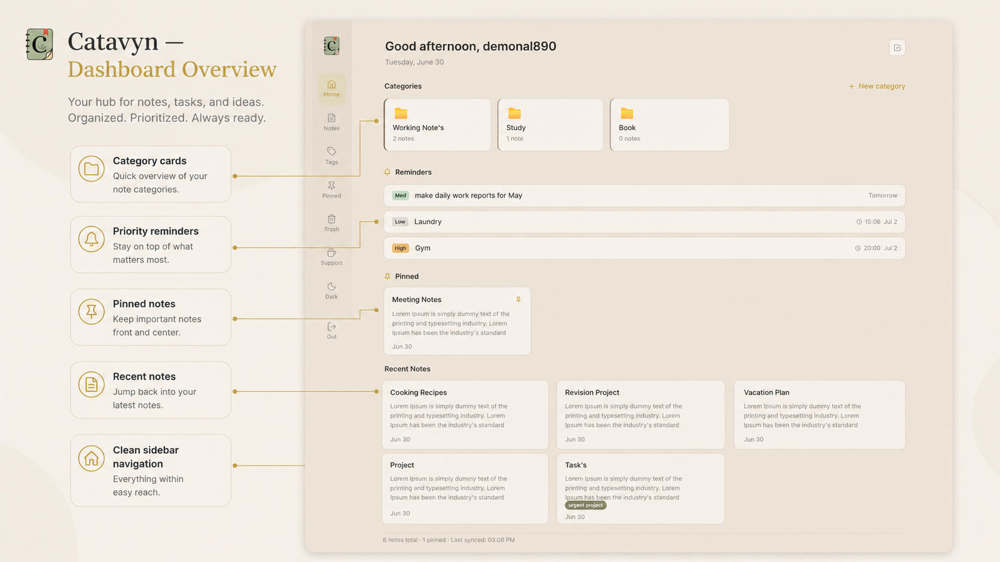
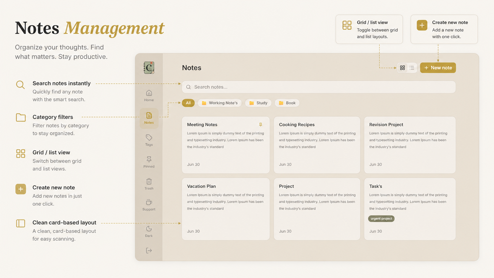
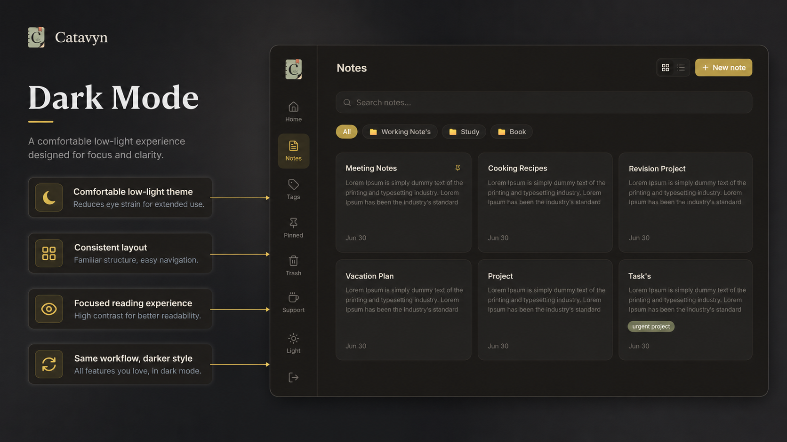
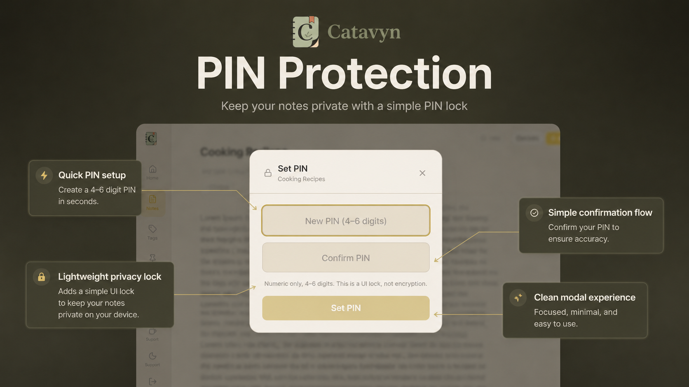
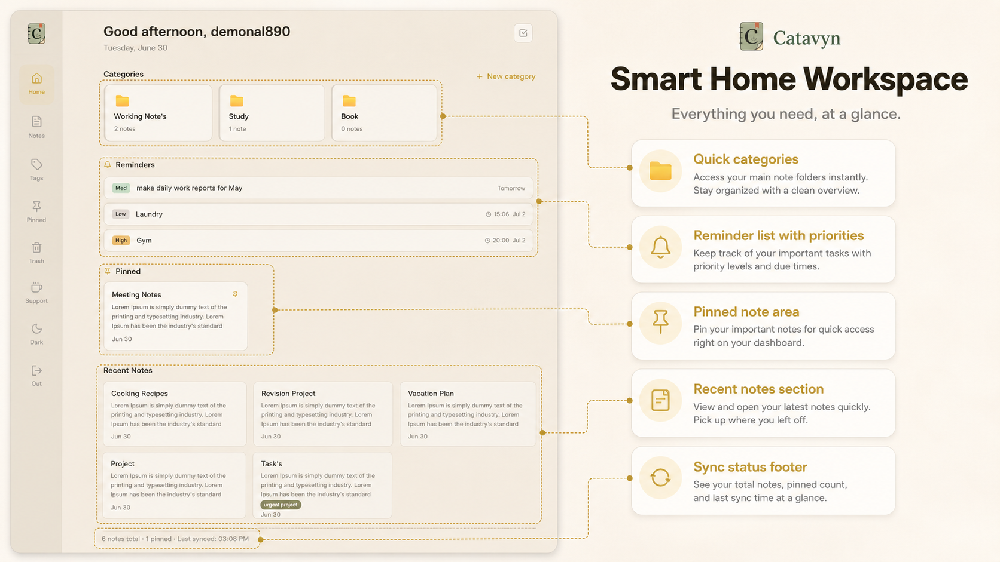

# Catavyn

A note-taking and daily task app. Free, open source, works on web and desktop.

**[catavyn.vercel.app](https://catavyn.vercel.app)** · [Download for Windows](https://github.com/andarezabasni/catavyn/releases/tag/v0.1.0)

---



<table>
  <tr>
    <td></td>
    <td></td>
  </tr>
  <tr>
    <td></td>
    <td></td>
  </tr>
</table>

---

## Features

- Notes with categories, tags, and pin support
- Lock individual notes with a PIN
- Daily task list — priority levels, due dates, mini calendar
- Full-text search across titles, content, and tags
- Trash with 30-day soft delete
- Dark mode
- Web + desktop app (Windows)

## Stack

- React 19 + Vite + TypeScript
- Tailwind CSS v4
- Supabase (auth + database)
- Tauri v2 (desktop)
- Vercel (web deploy)

## Running locally

You'll need Node 18+ and a Supabase project.

```bash
git clone https://github.com/andarezabasni/catavyn.git
cd catavyn
npm install
cp .env.example .env.local
```

Fill in your Supabase URL and anon key in `.env.local`, then run the SQL files in `supabase/migrations/` using the Supabase SQL Editor (run them in order).

```bash
npm run dev
```

Open `http://localhost:5173`.

## Desktop build

Download the Windows installer from [Releases](https://github.com/andarezabasni/catavyn/releases).

To build from source, you'll also need [Rust](https://rustup.rs/):

```bash
npm run tauri build
```

## License

MIT — see [LICENSE](LICENSE)
